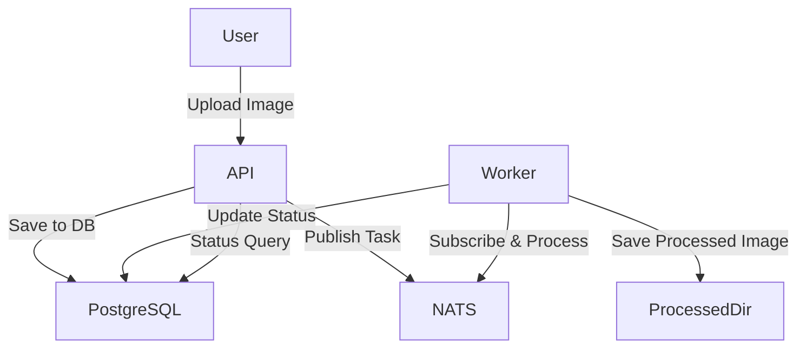

# Image Queue Demo

A robust, containerized image processing queue system built with **FastAPI**, **SQLAlchemy**, **Alembic**, **PostgreSQL**, **NATS JetStream**, and a Python worker using **Pillow**. The system allows users to upload images, which are then processed asynchronously by a worker and stored in a processed directory. The project is fully containerized with Docker Compose and includes integration and API tests.

---

## Features

- **FastAPI** backend for image upload and status querying
- **PostgreSQL** database for task tracking (via SQLAlchemy ORM)
- **NATS JetStream** for reliable task queueing
- **Worker** service processes images and updates task status
- **Docker Compose** for easy multi-service orchestration
- **Alembic** for database migrations
- **Comprehensive tests** using pytest and httpx

---

## Architecture



---

## Quick Start

### 1. Clone the Repository

```bash
git clone git@github.com:Oleg-Stukalov/image-queue-demo.git
cd image-queue-demo
```

### 2. Configure Environment

Copy the example secrets file and edit as needed:

```bash
cp .secrets.example.toml .secrets.toml
```

Edit `.secrets.toml` to set your database, NATS and path settings.

### 3. Build and Start Services

Copy the example 'docker-compose.example.yml' file and edit as needed:

```bash
cp docker-compose.example.yml ocker-compose.yml
```

Edit `docker-compose.example.yml` to set your settings.

Run
```bash
docker compose -f docker-compose.yml up --build
```

This will start:
- FastAPI app (http://localhost:8000)
- PostgreSQL database
- NATS JetStream server
- Image processing worker

### 4. Run Database Migrations

In a new terminal:

```bash
docker-compose -f docker-compose.yml exec api alembic upgrade head
```

## Using the application

After you have started the containers and run the database migration, you can use the application as follows:

1. **Open the app in your browser:**
   - Navigate to `http://<your-server-ip>:8000/` (replace `<your-server-ip>` with your actual server or VPS IP address).

2. **Upload an image:**
   - Use the upload form on the main page to upload an image file (for example, `test_image.JPG`).

3. **View the processed result:**
   - After uploading, you will be redirected to the result page.
   - You can also manually visit:
     ```
     http://<your-server-ip>:8000/result/test_image.JPG
     ```
   - Replace `<your-server-ip>` with your server's IP address and `test_image.JPG` with the name of your uploaded file.

If the image was processed successfully, you should see the processed image displayed on the result page.

---

## API Endpoints

### `POST /upload`

Upload an image file.

- **Request:** `multipart/form-data` with a file field named `file`
- **Response:** `{ "task_id": int, "filename": str, "message": str }`

### `GET /status/{task_id}`

Get the status of an image processing task.

- **Response:**
  - 200: `{ "task_id": int, "filename": str, "status": str, "upload_time": str }`
  - 404: `{ "detail": "Task not found" }`

### `GET /health`

Health check endpoint.

---

## Database Schema

**Table:** `image_tasks`

| Column      | Type    | Description                |
|-------------|---------|----------------------------|
| id          | int     | Primary key                |
| filename    | string  | Uploaded file name         |
| status      | enum    | `pending`, `processing`, `done` |
| upload_time | datetime| Upload timestamp           |

---

## Configuration

Configuration is loaded from environment variables or `.secrets.toml`:

- `DATABASE_URL` — PostgreSQL connection string
- `NATS_URL` — NATS JetStream connection string
- `UPLOADS_DIR` — Directory for uploaded images
- `PROCESSED_DIR` — Directory for processed images

See `.secrets.example.toml` for an example.

---

## Development

### Install dependencies

```bash
python -m venv venv
source venv/bin/activate
pip install -r requirements.txt
```

### Run API locally

```bash
uvicorn api.main:app --reload
```

### Run the worker locally

```bash
python worker/worker.py
```

---

## Testing

### Run all tests

```bash
PYTHONPATH=. UPLOADS_DIR=uploads PROCESSED_DIR=processed DATABASE_URL="postgresql+asyncpg://<login>:<password>@172.17.0.1:5432/imagequeue" NATS_URL="nats://172.17.0.1:4222" pytest tests/
```

### Test Coverage

- **API tests:** Upload, status query, and 404 handling
- **Integration test:** End-to-end test that uploads an image, waits for the worker to process it, and checks the final status

---

## Project Structure

```
.
├── api/                # FastAPI app, models, DB logic
├── worker/             # Image processing worker
├── uploads/            # Uploaded images (shared volume)
├── processed/          # Processed images (shared volume)
├── alembic/            # DB migrations
├── tests/              # API and integration tests
├── Dockerfile.api      # API Docker image
├── Dockerfile.worker   # Worker Docker image
├── docker-compose.example.yml
├── config.py           # Centralized config loader
├── requirements.txt
└── .secrets.example.toml
```

---

## License

MIT License

---

## Credits

- [FastAPI](https://fastapi.tiangolo.com/)
- [SQLAlchemy](https://www.sqlalchemy.org/)
- [Alembic](https://alembic.sqlalchemy.org/)
- [NATS](https://nats.io/)
- [Pillow](https://python-pillow.org/)
